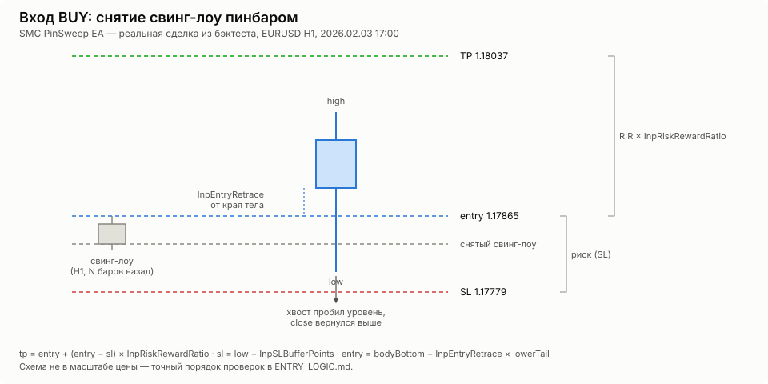

# Логика входа

Схема соответствует `OnTick()` в `SMC_PinSweep_EA.mq5` — порядок проверок и
причины отказа именно такие, как в коде (и как попадают в `SIGNAL_REJECTED`
в CSV-логе). Два триггера работают **параллельно и независимо**: на каждом
баре проверяются оба — пинбар со снятием ликвидности (`TryPinBarEntry`) и
поглощение по тренду без требования sweep (`TryEngulfingEntry`). Если сработали
оба и есть свободное место по `InpMaxPositions`, встанут обе лимитки. Перед
попыткой поглощения счётчик позиций/лимиток перепроверяется — так пинбар,
успевший занять последний слот, не даёт поглощению превысить лимит.
Фильтры тренда/спреда/ATR/новостей/премиум-дискаунта общие для обоих.

```mermaid
flowchart TD
    A[Новый закрытый бар InpEntryTF] --> B{Пятница, час >= InpFridayCloseHour?}
    B -- да --> B1[Закрыть всё, выйти]
    B -- нет --> C[ExpirePendingOrders]
    C --> D[Обновить структуру InpTrendTF и InpEntryTF]
    D --> E{Позиций + лимиток < InpMaxPositions?}
    E -- нет --> X0[Выход]
    E -- да --> F{Пятница, час >= InpFridayNoNewHour?}
    F -- да --> X0
    F -- нет --> G{Тренд InpTrendTF == тренд InpEntryTF, оба != NONE?}
    G -- нет --> X0
    G -- да --> H{Спред <= InpMaxSpreadPoints?}
    H -- нет --> X0
    H -- да --> ATR[minRange = InpMinRangeATR * ATR]

    subgraph PB [TryPinBarEntry]
        I{Диапазон >= minRange?}
        I -- нет --> R1[pinbar_range]
        I -- да --> J{Хвост >= InpMinTailRatio?}
        J -- нет --> R2[pinbar_tail]
        J -- да --> K{Направление == тренду?}
        K -- нет --> PBno1[нет]
        K -- да --> L{Новости активны?}
        L -- да --> R3[news]
        L -- нет --> M{Есть неснятый свинг?}
        M -- нет --> R4[нет уровня]
        M -- да --> N{Уровень снят хвостом?}
        N -- нет --> PBno2[нет]
        N -- да --> O{Откат >= InpMinRetracement?}
        O -- нет --> R5[откат мал]
        O -- да --> PBok[PlaceLimitOrder]
    end

    ATR --> I
    PBok --> S1{STOPS_LEVEL / лот ок?}
    S1 -- да --> S[Пинбар: ордер выставлен,\nсвинг помечается swept]

    EQ{InpUseEngulfing И есть место по InpMaxPositions?}
    R1 --> EQ
    R2 --> EQ
    PBno1 --> EQ
    R3 --> EQ
    R4 --> EQ
    PBno2 --> EQ
    R5 --> EQ
    S1 -- нет --> EQ
    S --> EQ

    EQ -- нет --> X0
    EQ -- да --> I2

    subgraph EG [TryEngulfingEntry]
        I2{Диапазон >= minRange И тело в [InpMinEngulfBodyRatio, InpMaxEngulfBodyRatio] * пред.?}
        I2 -- нет --> R6[engulf_range / not_engulfing]
        I2 -- да --> K2{Направление == тренду?}
        K2 -- нет --> EGno[нет]
        K2 -- да --> L2{Новости активны?}
        L2 -- да --> R7[news]
        L2 -- нет --> O2{Откат >= InpMinRetracement?}
        O2 -- нет --> R8[откат мал]
        O2 -- да --> EGok[PlaceEngulfLimitOrder]
    end

    EGok --> S2{STOPS_LEVEL / лот ок?}
    S2 -- да --> S3[Поглощение: ордер выставлен]
    S2 -- нет --> X0
    R6 --> X0
    EGno --> X0
    R7 --> X0
    R8 --> X0
```

Поглощение **не требует** снятия ликвидности (шаги M/N у пинбара) — только
совпадение направления с трендом на обоих ТФ (`InpTrendTF`/`InpEntryTF`),
тот же ATR-фильтр размера свечи и тот же фильтр премиум/дискаунт.

## Геометрия входа (пинбар BULL)




```
        high ──┐
                │  верхний хвост (upperTail)
     bodyTop ───┤
        Open/   │  тело свечи
       Close  ──┤
   bodyBottom ───┤
                │
        entry ──┤  ← min(Open,Close) − InpEntryRetrace * lowerTail
                │
                │  lowerTail (в него и идёт откат для входа)
                │
           sl ──┤  ← low − InpSLBufferPoints
         low  ──┘

  tp = entry + (entry − sl) * InpRiskRewardRatio
```

Для BEAR-пинбара всё зеркально: вход внутрь верхнего хвоста, стоп над
high + буфер, тейк вниз от входа на `InpRiskRewardRatio` от риска.

`InpEntryRetrace = 0` — вход от края тела (сразу на границе тела и хвоста),
чем больше значение, тем глубже внутрь хвоста и тем реже цена доходит
до уровня за `InpPendingLifeBars` баров.

## Геометрия входа (поглощение BULL)

```
       close ──┐
               │  тело поглощающей свечи
        entry ─┤  ← close − InpEngulfEntryRetrace * (close − open)
               │
        open ──┘
                  sl = low − InpSLBufferPoints
                  tp = entry + (entry − sl) * InpRiskRewardRatio
```

`InpEngulfEntryRetrace = 0` — вход по цене close (агрессивно, без отката),
`= 1` — откат до open (глубоко, реже исполняется). Для BEAR всё зеркально:
откат от close вниз к open, стоп над high + буфер.
