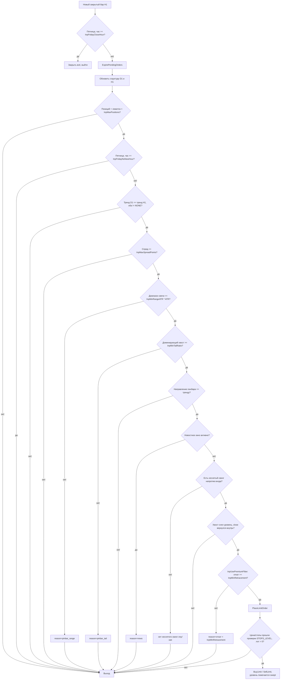

# Логика входа

Схема соответствует `OnTick()` в `SMC_PinSweep_EA.mq5` — порядок проверок и
причины отказа именно такие, как в коде (и как попадают в `SIGNAL_REJECTED`
в CSV-логе).



## Геометрия входа (пинбар BULL)


```
        high ──┐
                │  верхний хвост (upperTail)
     bodyTop ───┤
        Open/   │  тело свечи
       Close  ──┤
   bodyBottom ───┤
                │
        entry ──┤  ← min(Open,Close) − InpEntryRetrace * lowerTail
                │
                │  lowerTail (в него и идёт откат для входа)
                │
           sl ──┤  ← low − InpSLBufferPoints
         low  ──┘

  tp = entry + (entry − sl) * InpRiskRewardRatio
```

Для BEAR-пинбара всё зеркально: вход внутрь верхнего хвоста, стоп над
high + буфер, тейк вниз от входа на `InpRiskRewardRatio` от риска.

`InpEntryRetrace = 0` — вход от края тела (сразу на границе тела и хвоста),
чем больше значение, тем глубже внутрь хвоста и тем реже цена доходит
до уровня за `InpPendingLifeBars` баров.
